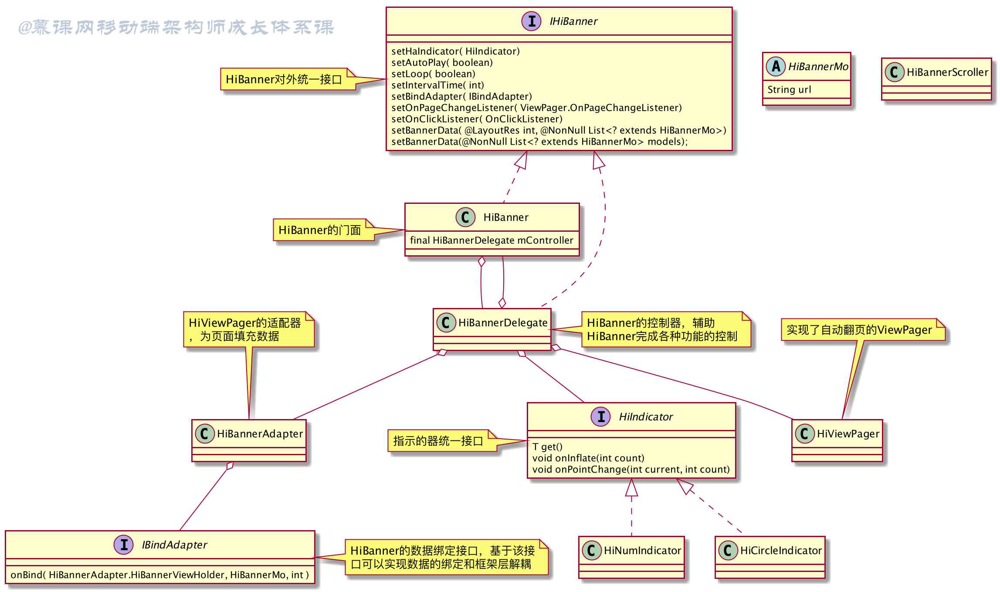

# 轻量级高扩展banner组件 详解


源码：https://github.com/LiYaokun97/ui-framework

建议跟着源码来理解下面的内容


## 前置知识

SparseArray 

https://blog.csdn.net/weixin_39460667/article/details/81774128?utm_medium=distribute.pc_relevant.none-task-blog-2~default~baidujs_baidulandingword~default-5-81774128-blog-80022668.235\^v40\^pc_relevant_anti_vip&spm=1001.2101.3001.4242.4&utm_relevant_index=6

https://blog.csdn.net/weixin_33898876/article/details/88021040?utm_medium=distribute.pc_relevant.none-task-blog-2~default~baidujs_baidulandingword~default-4-88021040-blog-80022668.235\^v40\^pc_relevant_anti_vip&spm=1001.2101.3001.4242.3&utm_relevant_index=5 

这个链接是sparseArray的具体的原理

简单来说就是，每次插入的时候，会通过二分查找，查找mKeys 这个array中是否以及存在key

- 如果存在，就修改
- 不存在，上面的binarySerach返回的是该插入的位置的相反数，put方法会尝试在这个位置放入新的key，在mValues中相同的位置放入value


## 组件设计

### 效果

可以见同一个文件夹下的录屏文件


### 拆解

功能上，我们希望实现：

1. 支持自动无限轮播
2. 支持滚动速度设置
3. 支持UI以及指示器的高度定制
4. 不耦合网络图片库
5. 数据和界面之间的分离

难点主要有

1. 有限的item如何实现无限轮播？
2. 指示器样式各异，如何实现指示器的高度定制？
3. Banner需要展示网络图片的话，如何实现图片库和Banner组件的解耦？
4. 如何设置viewPager的滚动速度？


### UML类图




### 设计

看到上面的UML类图，实际上，核心类只有四个

- HiBanner (HiBannerDelegate是该类的代理，为了暴露出的HiBanner看清爽简洁，HiBanner的功能都是由HiBannerDelegate代理的，它们两个类可以视为同一个)
- HiBannerAdapter
- HiIndicator
- HiViewPager

整体的设计，只要理解了这四个类，基本上就理解了它的架构设计。

让我们来一个一个解释一下它们。看到 HiBannerAdapter，HiBannerAdapter继承PagerAdapter，起到设置数据、实例化子View等功能，具体代码见下 

```java

/**
 * HiViewPager的适配器，为页面填充数据
 */
public class HiBannerAdapter extends PagerAdapter {
    private Context mContext;
    //    private SparseArray<HiBannerViewHolder> mCachedViews = new SparseArray<>();
    private HiBanner.OnBannerClickListener mBannerClickListener;
    private IBindAdapter mBindAdapter;
    private List<? extends HiBannerMo> models;
    /**
     * 是否开启自动轮播
     */
    private boolean mAutoPlay = true;
    /**
     * 非自动轮播状态下是否可以循环切换
     */
    private boolean mLoop = false;
    private int mLayoutResId = -1;
    private SparseArray<Object> mCachedViews;

    public HiBannerAdapter(@NonNull Context mContext) {
        this.mContext = mContext;
    }

    public void setBannerData(@NonNull List<? extends HiBannerMo> models) {
        this.models = models;
        initCachedView();
        notifyDataSetChanged();

    }

    private void initCachedView() {
        mCachedViews = new SparseArray<>();
        for (int i = 0; i < models.size(); i++) {
            HiBannerViewHolder viewHolder = new HiBannerViewHolder(createView(LayoutInflater
                    .from(mContext), null));
            mCachedViews.put(i, viewHolder);
        }
    }

    // ...
    // 这里省略了一些简单的方法
	
    /**
     * 获取Banner页面数量
     *
     * @return
     */
    public int getRealCount() {
        return models == null ? 0 : models.size();
    }

    @Override
    public int getCount() {
        //无限轮播关键点
        return mAutoPlay ? Integer.MAX_VALUE : (mLoop ? Integer.MAX_VALUE : getRealCount());
    }

    /**
     * 获取初次展示的item位置
     *
     * @return
     */
    public int getFirstItem() {
        //这里是为了配合instantiateItem方法中realPosition = position % getRealCount();
        // - (Integer.MAX_VALUE / 2) % getRealCount()的主要目的是用于获取realPosition=0的位置
        return Integer.MAX_VALUE / 2 - (Integer.MAX_VALUE / 2) % getRealCount();
    }

    @Override
    public boolean isViewFromObject(@NonNull View view, @NonNull Object object) {
        return view == object;
    }

    @NonNull
    @Override
    public Object instantiateItem(@NonNull ViewGroup container, int position) {
        int realPosition = position;
        if (getRealCount() > 0) {
            realPosition = position % getRealCount();
        }
        // 注释1
        // 这个地方可以加深理解，如果是new的话会频繁发生内存抖动的，可以加到文章里面去
        HiBannerViewHolder viewHolder = getViewHolder(LayoutInflater.from(mContext), null, realPosition);
        onBind(viewHolder, models.get(realPosition), realPosition);
        container.addView(viewHolder.rootView);
        return viewHolder.rootView;
    }

    @Override
    public void destroyItem(@NonNull ViewGroup container, int position, @NonNull Object object) {
        container.removeView((View) object);
//        if (object != null)
        object = null;
    }


    private View createView(LayoutInflater layoutInflater, ViewGroup parent) {
        if (mLayoutResId == -1) {
            throw new IllegalArgumentException("you must be set setLayoutResId first");
        }

        return layoutInflater.inflate(mLayoutResId, parent, false);
    }

    private HiBannerViewHolder getViewHolder(LayoutInflater layoutInflater, ViewGroup parent, int position) {
        if (mLayoutResId == -1) {
            throw new IllegalArgumentException("you must be set setLayoutResId first");
        }

        HiBannerViewHolder cachedView = (HiBannerViewHolder) mCachedViews.get(position);
        if (cachedView != null) return cachedView;

        HiBannerViewHolder hiBannerViewHolder = new HiBannerViewHolder(
                createView(layoutInflater, parent));
        mCachedViews.put(position, hiBannerViewHolder);
        return hiBannerViewHolder;
    }

    protected void onBind(@NonNull final HiBannerViewHolder viewHolder, @NonNull final HiBannerMo bannerMo, final int position) {
        viewHolder.rootView.setOnClickListener(new View.OnClickListener() {
            @Override
            public void onClick(View v) {
                if (mBannerClickListener != null) {
                    mBannerClickListener.onBannerClick(viewHolder, bannerMo, position);
                }
            }
        });
        if (mBindAdapter != null) {
            mBindAdapter.onBind(viewHolder, bannerMo, position);
        }
    }

    @Override
    public int getItemPosition(@NonNull Object object) {
        //让item每次都会刷新
        return POSITION_NONE;
    }

    public static class HiBannerViewHolder {
        private SparseArray<View> viewHolderSparseArr;
        View rootView;

        HiBannerViewHolder(View rootView) {
            this.rootView = rootView;
        }

        public View getRootView() {
            return rootView;
        }

        public <V extends View> V findViewById(int id) {
            if (!(rootView instanceof ViewGroup)) {
                return (V) rootView;
            }
            if (this.viewHolderSparseArr == null) {
                this.viewHolderSparseArr = new SparseArray<>(1);
            }
			// 注释2
            V childView = (V) viewHolderSparseArr.get(id);
            if (childView == null) {
                childView = rootView.findViewById(id);
                this.viewHolderSparseArr.put(id, childView);
            }

            return childView;
        }

    }
}
```

上面的代码都比较常规，就讲两个地方，看到注释1 和 注释2

这两个地方都做了缓存，注释1用SparseArray 缓存了所有的HiBannerViewHolder，可以设计得更严格，只缓存3个HiBannerViewHolder 也是可以做到的

注释2则是缓存了HiBannerViewHolder中的子view


HiIndicator

```java
/**
 * 圆形指示器
 */
class HiCircleIndicator @JvmOverloads constructor(
    context: Context,
    attrs: AttributeSet? = null,
    defStyleAttr: Int = 0
) : FrameLayout(context, attrs, defStyleAttr), HiIndicator<FrameLayout?> {

    companion object {
        private const val VWC = ViewGroup.LayoutParams.WRAP_CONTENT
    }

    /**
     * 正常状态下的指示点
     */
    @DrawableRes
    private val mPointNormal = R.drawable.shape_point_normal

    /**
     * 选中状态下的指示点
     */
    @DrawableRes
    private val mPointSelected = R.drawable.shape_point_select

    /**
     * 指示点左右内间距
     */
    private var mPointLeftRightPadding = 0

    /**
     * 指示点上下内间距
     */
    private var mPointTopBottomPadding = 0

    init {
        mPointLeftRightPadding = HiDisplayUtil.dp2px(5f, context.resources)
        mPointTopBottomPadding = HiDisplayUtil.dp2px(15f, context.resources)
    }

    override fun get(): FrameLayout {
        return this
    }

    override fun onInflate(count: Int) {
        removeAllViews()
        if (count <= 0) {
            return
        }
        val groupView = LinearLayout(context)
        groupView.orientation = LinearLayout.HORIZONTAL
        var imageView: ImageView
        val imageViewParams = LinearLayout.LayoutParams(VWC, VWC)
        imageViewParams.gravity = Gravity.CENTER_VERTICAL
        imageViewParams.setMargins(
            mPointLeftRightPadding,
            mPointTopBottomPadding,
            mPointLeftRightPadding,
            mPointTopBottomPadding
        )
        for (i in 0 until count) {
            imageView = ImageView(context)
            imageView.layoutParams = imageViewParams
            if (i == 0) {
                imageView.setImageResource(mPointSelected)
            } else {
                imageView.setImageResource(mPointNormal)
            }
            groupView.addView(imageView)
        }
        val groupViewParams = LayoutParams(VWC, VWC)
        groupViewParams.gravity = Gravity.CENTER or Gravity.BOTTOM
        addView(groupView, groupViewParams)
    }

    override fun onPointChange(current: Int, count: Int) {
        val viewGroup = getChildAt(0) as ViewGroup
        for (i in 0 until viewGroup.childCount) {
            val imageView = viewGroup.getChildAt(i) as ImageView
            if (i == current) {
                imageView.setImageResource(mPointSelected)
            } else {
                imageView.setImageResource(mPointNormal)
            }
            imageView.requestLayout()
        // 这里改成image.invalidate()也可以? 是的，可以，
        // 其实这一行不写都行！
        }
    }
}
```


 HiViewPager 

todo ： 解释一下 

//fix 使用RecyclerView + ViewPager bug https://blog.csdn.net/u011002668/article/details/72884893

```java
package org.devio.hi.ui.banner.core;

import android.annotation.SuppressLint;
import android.app.Activity;
import android.content.Context;
import android.os.Handler;
import android.view.MotionEvent;

import androidx.annotation.NonNull;
import androidx.viewpager.widget.ViewPager;

import java.lang.reflect.Field;

/**
 * 实现了自动翻页的ViewPager
 */
public class HiViewPager extends ViewPager {
    private int mIntervalTime;
    /**
     * 是否开启自动轮播
     */
    private boolean mAutoPlay = true;
    private boolean isLayout;
    private Handler mHandler = new Handler();
    private Runnable mRunnable = new Runnable() {

        public void run() {
            next();
            mHandler.postDelayed(this, mIntervalTime);//延时一定时间执行下一次
        }

    };


    public HiViewPager(@NonNull Context context) {
        super(context);
    }

    public void setAutoPlay(boolean autoPlay) {
        this.mAutoPlay = autoPlay;
        if (!mAutoPlay) {
            mHandler.removeCallbacks(mRunnable);
        }
    }

    @SuppressLint("ClickableViewAccessibility")
    @Override
    public boolean onTouchEvent(MotionEvent ev) {
        switch (ev.getAction()) {
            case MotionEvent.ACTION_UP:
            case MotionEvent.ACTION_CANCEL:
                start();
                break;
            default:
                stop();
                break;
        }

        return super.onTouchEvent(ev);
    }

    @Override
    protected void onLayout(boolean changed, int l, int t, int r, int b) {
        super.onLayout(changed, l, t, r, b);
        isLayout = true;
    }

    @Override
    protected void onAttachedToWindow() {
        super.onAttachedToWindow();
        if (isLayout && getAdapter() != null && getAdapter().getCount() > 0) {
            try {
                //fix 使用RecyclerView + ViewPager bug https://blog.csdn.net/u011002668/article/details/72884893
                Field mScroller = ViewPager.class.getDeclaredField("mFirstLayout");
                mScroller.setAccessible(true);
                mScroller.set(this, false);
            } catch (Exception e) {
                e.printStackTrace();
            }
        }
        start();
    }

    @Override
    protected void onDetachedFromWindow() {
        //fix 使用RecyclerView + ViewPager bug
        if (((Activity) getContext()).isFinishing()) {
            super.onDetachedFromWindow();
        }
        stop();
    }

    /**
     * 设置ViewPager的滚动速度
     *
     * @param duration page切换的时间长度
     */
    public void setScrollDuration(int duration) {
        try {
            Field scrollerField = ViewPager.class.getDeclaredField("mScroller");
            scrollerField.setAccessible(true);
            scrollerField.set(this, new HiBannerScroller(getContext(), duration));
        } catch (Exception e) {
            e.printStackTrace();
        }
    }

    /**
     * 设置页面停留时间
     *
     * @param intervalTime 停留时间单位毫秒
     */
    public void setIntervalTime(int intervalTime) {
        this.mIntervalTime = intervalTime;
    }

    public void start() {
        mHandler.removeCallbacksAndMessages(null);
        if (mAutoPlay) {
            mHandler.postDelayed(mRunnable, mIntervalTime);
        }
    }

    public void stop() {
        mHandler.removeCallbacksAndMessages(null);           //停止Timer
    }

    /**
     * 设置下一个要显示的item，并返回item的pos
     *
     * @return 下一个要显示item的pos
     */
    private int next() {
        int nextPosition = -1;

        if (getAdapter() == null || getAdapter().getCount() <= 1) {
            stop();
            return nextPosition;
        }
        nextPosition = getCurrentItem() + 1;
        //下一个索引大于adapter的view的最大数量时重新开始
        if (nextPosition >= getAdapter().getCount()) {
            nextPosition = ((HiBannerAdapter) getAdapter()).getFirstItem();
        }
        setCurrentItem(nextPosition, true);
        return nextPosition;
    }
}
```


### 难点解答

#### 有限的item如何实现无限轮播？

网上很多解决方案，再次不再重复


#### 指示器样式各异，如何实现指示器的高度定制？

在设计中，我们将indicator与HiBanner解耦，只需要自己实现HiIndicator接口，就可以定制自己的指示器。


#### Banner需要展示网络图片的话，如何实现图片库和Banner组件的解耦？

mHiBanner需要设置一个bindAdapter（这个bindAdapter不同于上上面UML类图中的HiBannerAdapter，不要搞混），这个bindAapter中有一个onBind方法，当数据被bind到对应的viewHolder中时，会调用该方法。

在我们暴露出的onBind方法中，用户可以自行选择自己要使用的网络图片库来设置图片。

本质上，我们并不需要特意来解决这个问题，只因为我们良好的设计把onBind的过程暴露出来，就可以很容易地解决图片库和Banner组件的耦合。

```java
// 这段代码位于 当你使用 HiBanner 的activity或者fragment中
// 这是kotlin代码
mHiBanner.setBindAdapter { viewHolder, mo, position ->
            val imageView: ImageView = viewHolder.findViewById(R.id.iv_image)
            Glide.with(this@HiBannerDemoActivity).load(mo.url).into(imageView)
            val titleView: TextView = viewHolder.findViewById(R.id.tv_title)
            titleView.text = mo.url
            Log.d("----position:", position.toString() + "url:" + mo.url)
        }

// IBindAdapter接口，
// 这是java代码
public interface IBindAdapter {
    void onBind(HiBannerAdapter.HiBannerViewHolder viewHolder, HiBannerMo mo, int position);
}
```


#### 如何设置viewPager的滚动速度？

viewPager 没有把mScroller暴露出，也没有提供对应的设置滚动速度的方法，我们只能使用反射来调用，将mScroller设置为我们自定义的类

```java
    /**
     * 设置ViewPager的滚动速度
     *
     * @param duration page切换的时间长度
     */
    public void setScrollDuration(int duration) {
        try {
            Field scrollerField = ViewPager.class.getDeclaredField("mScroller");
            scrollerField.setAccessible(true);
            scrollerField.set(this, new HiBannerScroller(getContext(), duration));
        } catch (Exception e) {
            e.printStackTrace();
        }
    }

```

